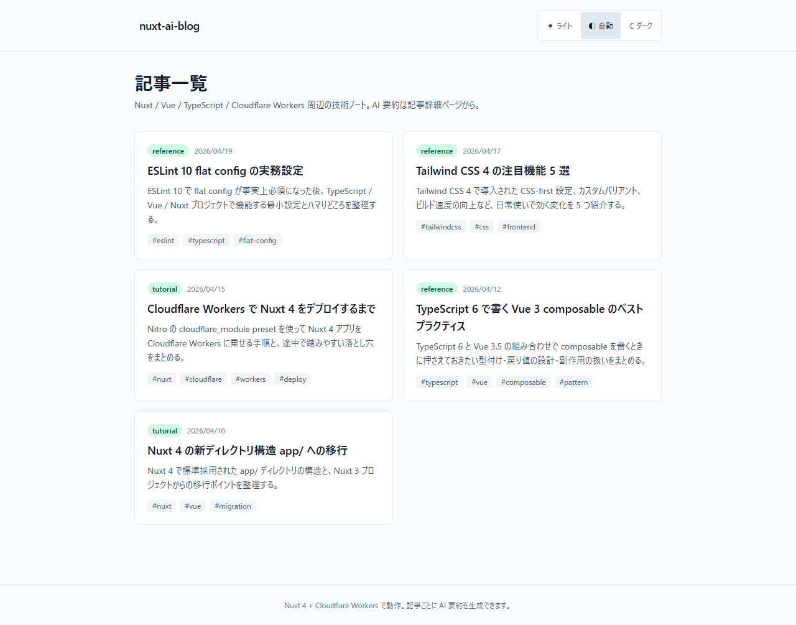
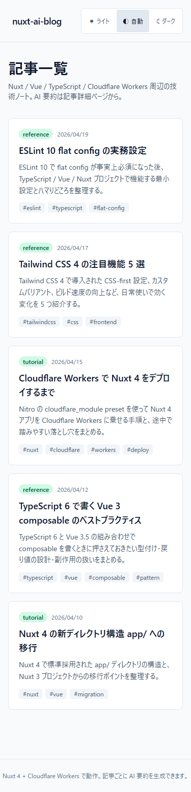
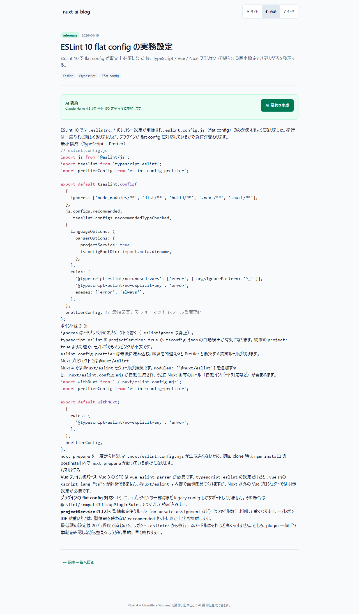
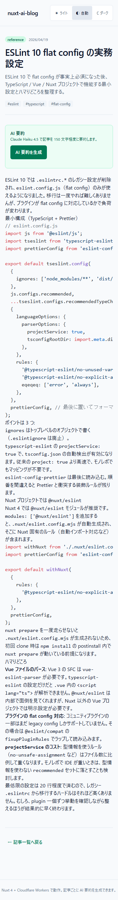
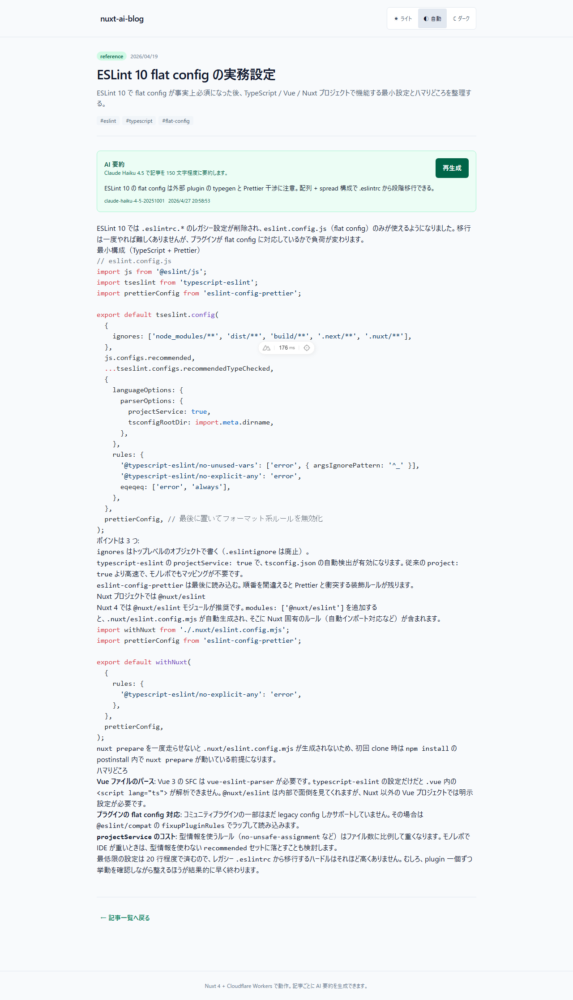
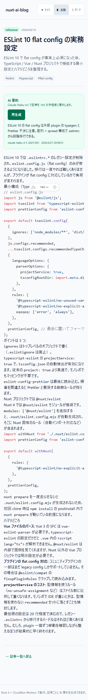
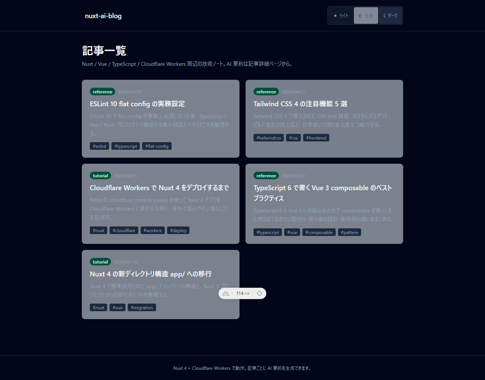
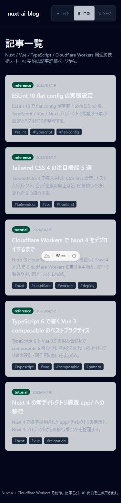

# nuxt-ai-blog

> Nuxt Content ベースの技術ブログ。記事検索とタグ絞り込み、記事ごとの Anthropic Claude AI 要約を備えたデモ。

Markdown で書いた記事を Nuxt Content 3 が読み取って一覧 / 詳細ページとして表示します。記事一覧では検索とタグ絞り込みができ、記事詳細ページでアクセスキーを入力すると Claude Haiku 4.5 が記事内容を 150 字以内に要約して返します。AI生成はアクセスキー、per-IP short-window guard、Durable Objects の summary cache / global daily quota で保護します。

## Demo

- **Live demo**: https://nuxt-ai-blog.atlas-lab.workers.dev
- **Source**: https://github.com/proto-atlas/nuxt-ai-blog

## Reviewer Quick Path

- **30 秒で見る**: Public demo で記事一覧、検索、タグ絞り込み、記事詳細をキーなしで確認できます。
- **AI preview**: 記事詳細のAI要約欄に、外部AI APIを呼ばないキーなしプレビューがあります。
- **5 分で見る**: [docs/REVIEWER.md](./docs/REVIEWER.md) に、公開デモ範囲、キー保護範囲、主な証跡への導線をまとめています。
- **Evidence**: [docs/evidence/REVIEWER-INDEX.md](./docs/evidence/REVIEWER-INDEX.md) に、README上の主張と証跡ファイルの対応をまとめています。
- **Live AI**: 課金・乱用防止のためアクセスキーで保護しています。

## Quality Gate (2026-04-29 確認)

| Gate | コマンド | 結果 |
|---|---|---|
| typecheck | `npm run typecheck` | exit 0 (Nuxt typecheck、`vue-tsc` 経由) |
| lint | `npm run lint` | exit 0 (warning 0、ESLint + Prettier) |
| Vitest unit | `npm run test:coverage -- --maxWorkers=1` | **121 件 pass / 18 ファイル** |
| Vitest coverage | `npm run test:coverage -- --maxWorkers=1` | stmts 84.86 / branches 79.20 / funcs 90.00 / lines 86.49 (gate `lines>=60 / branches>=50 / funcs>=70 / statements>=60` 通過) |
| Nitro build | `npm run build` | 935 kB / 308 kB gzip (Cloudflare Workers Module preset) |
| Playwright E2E | `npm run e2e -- --project=chromium` | **10 / 10 pass** (ai-summary 3 + blog 4 + a11y target-size 3、1 worker 固定) |
| 公開禁止ワード | `npm run check:publish` | exit 0 (Node 版、Windows / macOS / Linux 共通) |
| ポートフォリオ提出 gate | `npm run verify:portfolio` | 上記すべてを順に実行 |

`docs/evidence/` 配下に各 gate の検証根拠を保存。`npm audit --audit-level=high` は 2026-04-29 時点で 0 vulnerabilities。

## Evidence Index

| Evidence | 用途 |
|---|---|
| [`docs/evidence/a11y-target-size-2026-04-27.md`](docs/evidence/a11y-target-size-2026-04-27.md) | WCAG 2.2 Target Size 44×44 の包括検査結果 |
| [`docs/evidence/production-smoke-2026-04-28.md`](docs/evidence/production-smoke-2026-04-28.md) | production URL の基本導線と `/api/summary` invalid payload の smoke 結果 |
| [`docs/evidence/dependency-audit-2026-04-28.md`](docs/evidence/dependency-audit-2026-04-28.md) | `npm audit --audit-level=high --json` の結果 (0 vulnerabilities) |
| [`docs/evidence/lighthouse-2026-04-28.md`](docs/evidence/lighthouse-2026-04-28.md) | production URL の Lighthouse 13.0.1 計測結果 |
| [`docs/evidence/release-baseline-2026-04-29.md`](docs/evidence/release-baseline-2026-04-29.md) | 公開前再検証の baseline |
| [`docs/evidence/summary-abuse-protection-2026-04-29.md`](docs/evidence/summary-abuse-protection-2026-04-29.md) | `/api/summary` の濫用対策確認 |
| [`docs/evidence/summary-durable-objects-2026-04-29.md`](docs/evidence/summary-durable-objects-2026-04-29.md) | Durable Objects summary cache / global daily quota の実装確認 |
| [`docs/evidence/production-smoke-2026-04-29.md`](docs/evidence/production-smoke-2026-04-29.md) | deploy後の公開URL、未認証拒否、本番live AI要約smoke結果 |
| [`docs/evidence/REVIEWER-INDEX.md`](docs/evidence/REVIEWER-INDEX.md) | 公開向け Evidence Map |
| [`docs/evidence/README.md`](docs/evidence/README.md) | Evidence ディレクトリ全体の目次 |

## Screenshots

PC (1280×800) と SP (375×812 / iPhone 15 相当) で記事一覧 / 記事詳細 / AI 要約結果 / ダークモードの 4 シーンを撮影。AI 要約は Playwright `page.route` で `/api/summary` を 200 mock し、実 Anthropic への課金を発生させていない (`scripts/capture-screenshots.mjs`)。

| シーン | PC (1280×800) | SP (375×812) |
|---|---|---|
| 記事一覧 |  |  |
| 記事詳細 |  |  |
| AI 要約結果 |  |  |
| ダークモード |  |  |

撮影手順: 別ターミナルで `npm run dev` を起動 → `npm run capture:screenshots` で 8 枚生成 (`docs/screenshots/*.png`)。

## Features

- **AI 要約**: 記事ごとに Claude Haiku 4.5 で 150 字以内の日本語要約を生成（Cloudflare Workers Edge 実行）。要約源は title + description + 本文 MDC AST から抽出した text を 4000 文字 truncate
- **記事検索 / タグ絞り込み**: 記事一覧で title / description / category / tags をクライアント側で即時フィルタ
- **キャッシュ**: 同 slug / article hash / model の連続呼び出しは `SummaryCacheDO` (TTL 1h) でコスト抑制、`cached: true` バッジで可視化。dev / test のみ in-memory fallback
- **多層コスト保護**: AI生成は server-only `NUXT_SUMMARY_ACCESS_KEY` によるアクセスキー必須。さらに per-IP sliding window 10 req/60s（CF-Connecting-IP ベース）+ 固定名 `GlobalSummaryQuotaDO` の global daily live-generation quota 200 req/UTC日 (環境変数 NUXT_DAILY_LIMIT で上書き可) + Anthropic Spend Limit ($5〜$10/月) の多層防御。429 時は `Retry-After` ヘッダで誘導
- **エラー設計**: `SummaryErrorCode` union (access_required / rate_limit / invalid_input / article_not_found / upstream_unavailable / server_misconfigured / unknown) に統一、UI には日本語ラベルのみ表示。SDK 例外の生 message / 環境変数名 / Zod 詳細は console.error でサーバー側にのみ残す
- **ダークモード 3 択**: ライト / 自動 / ダーク、`@nuxtjs/color-mode` + Tailwind v4 `@custom-variant` 連動、`localStorage` 永続化
- **セキュリティヘッダ 6 件**: nosniff / X-Frame-Options DENY / Referrer-Policy / Permissions-Policy / HSTS / Content-Security-Policy を Nitro `routeRules` で全ルート一括付与
- **client disconnect 時の課金保護**: `wrangler.jsonc` に `enable_request_signal` flag を設定、ページ離脱時に Anthropic SDK の リクエストが abort される

## Tech Stack

- Nuxt 4.4.2 + Vue 3.5 + TypeScript 6 (strict)
- @nuxt/content 3 (Markdown 管理 + MDC AST 走査で本文抽出)
- @nuxtjs/color-mode (class 戦略ダークモード)
- @nuxtjs/sitemap (動的 URL 生成)
- Tailwind CSS 4 (Vite プラグイン経由)
- @anthropic-ai/sdk 0.90 (AI 要約)
- ESLint 10 (flat config, @nuxt/eslint 統合)
- Vitest 4 + @nuxt/test-utils + happy-dom (Unit 121 件、coverage stmts 84.86 / branches 79.20 / funcs 90.00 / lines 86.49)
- Playwright 1.59 (E2E Chromium 10 シナリオ: blog 4 + AI 要約 3 page.route mock + a11y target-size 3)
- Cloudflare Workers (Nitro cloudflare_module preset) + Durable Objects (`GlobalSummaryQuotaDO`, `SummaryCacheDO`)

## Lighthouse (production)

[Production URL](https://nuxt-ai-blog.atlas-lab.workers.dev/) を 2026-04-28 時点 (Lighthouse 13.0.1, Edge headless) で計測:

| Strategy | Performance | Accessibility | Best Practices | SEO |
|---|---:|---:|---:|---:|
| desktop | 99 | 100 | 100 | 100 |
| mobile | 93 | 100 | 100 | 100 |

Core Web Vitals: desktop FCP 0.6s / LCP 0.6s / TBT 0ms / CLS 0、mobile FCP 1.6s / LCP 1.6s / TBT 290ms / CLS 0。詳細は [`docs/evidence/lighthouse-2026-04-28.md`](docs/evidence/lighthouse-2026-04-28.md)。

## Requirements

- Node.js 24.x LTS
- npm 11+

## Development

```bash
npm install # nuxt prepare が postinstall で走る
npm run dev # http://localhost:3000
```

## Deployment

Cloudflare Workers へ deploy する前に、AI 要約用の secret を登録します。

```bash
npx wrangler secret put NUXT_ANTHROPIC_API_KEY
npx wrangler secret put NUXT_SUMMARY_ACCESS_KEY
npm run deploy
```

`wrangler.jsonc` には summary cache / quota 用の Durable Objects binding と SQLite-backed migration を含めています。`nuxt build` 後に `wrangler deploy --dry-run` で `SUMMARY_QUOTA` / `SUMMARY_CACHE` / `DB` / `ASSETS` binding が認識されることを確認済みです。

## Testing

```bash
npm run check # typecheck + lint + Vitest
npm run test:coverage # coverage gate
npx playwright test --project=chromium # E2E Chromium (10 シナリオ)
```

`/api/summary` は `page.route('**/api/summary')` で JSON モックして実 Anthropic への課金を発生させません。AI 要約 E2E ではアクセスキー入力後の成功フロー / 429 rate_limit / 500 upstream_unavailable の 3 ケースを検証し、エラー時に内部詳細 (Anthropic / stack 等) が UI に漏れない invariant を assert しています。

## CI / DevOps

`.github/workflows/ci.yml` の構成:

| ジョブ | 内容 |
|---|---|
| `quality-gate` | typecheck → lint → `test:coverage` (閾値強制) → `npm audit --audit-level=high` → 禁止ワード scan → build |
| `e2e` | Playwright Chromium 10 シナリオ。`quality-gate` 通過後 |
| `deploy` | `main` への push のみ。`quality-gate` + `e2e` 通過後、`CLOUDFLARE_API_TOKEN` + `CLOUDFLARE_ACCOUNT_ID` が repo secrets に登録されている場合だけ Cloudflare Workers へ自動 deploy。未設定の場合は skip |

ローカル `SPEC.md` は本リポジトリ専用の内部メモで、公開対象外です (`.gitignore`)。CI / Architecture / 設計判断の Public 説明はこの README と `docs/ARCHITECTURE.md` / `docs/DESIGN-DECISIONS.md` に集約しています。

## Dependencies and Known Constraints

### npm audit (moderate 残)

`npm audit --audit-level=high` を CI quality-gate でブロッキング実行しています。一方で moderate レベルは Nuxt 4 / Nitro / `@nuxt/content` / `@anthropic-ai/sdk` の transitive 由来でアップストリーム修正待ちのため、意図的に許容しています。

### Cloudflare Workers の isolate 分散と rate limit

`/api/summary` の summary cache と global daily quota は Durable Objects に移行しています。quota の source of truth は固定名 `GlobalSummaryQuotaDO` で、slug / IP / articleHash / cache key ごとには分散させません。summary cache は `SummaryCacheDO` で `summary:v1:<model>:<slug>:<articleHash>` を key にし、記事更新や model 変更時に古い要約を使わない設計です。per-IP sliding window は引き続き in-memory short-window guard なので、本番SaaS化する場合は Cloudflare Rate Limiting binding や Turnstile との併用を検討します。

### `@nuxt/content` の sqlite-wasm

dev / Node.js native sqlite で動かしており、Cloudflare Workers 本番では `@nuxt/content` が D1 database に自動切替する旨の警告が出ます (`Deploying to Cloudflare requires using D1 database`)。D1 binding への完全移行と client bundle の sqlite-wasm 削減は今後の運用課題です。

### AI 要約アクセスキー

`/api/summary` は server-only secret `NUXT_SUMMARY_ACCESS_KEY` とリクエストヘッダ `X-Summary-Access-Key` を照合します。公開ページは閲覧可能なまま、live AI 生成だけ利用条件を設けるためのデモ向け境界です。ユーザー別権限管理ではないため、本番 SaaS として運用する場合は Turnstile、Cloudflare Access、Durable Objects、またはアカウント制の認証に置き換えてください。

### Windows 環境

`scripts/check-before-publish.sh` は bash スクリプトのため、素の Windows cmd / PowerShell では動きません。Git Bash / WSL を使うか、husky pre-commit に依存してください。

## License

MIT
