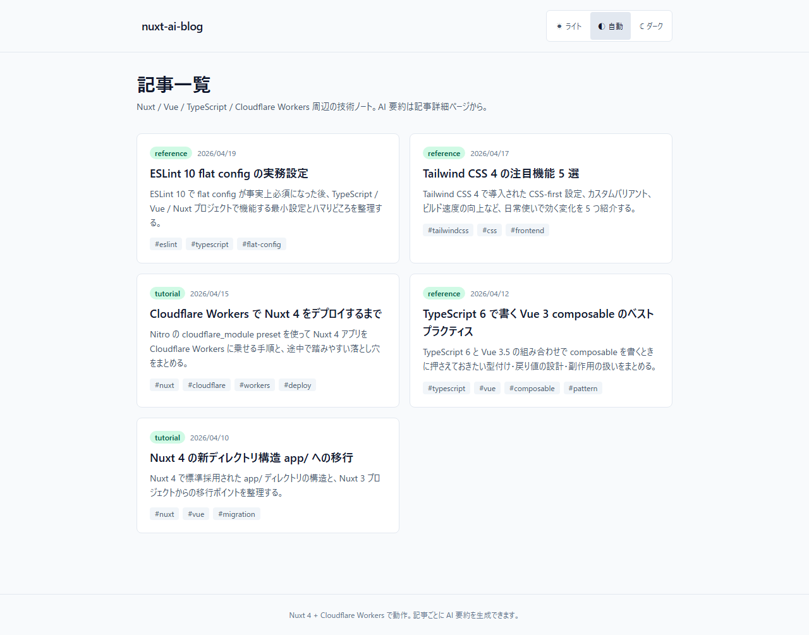
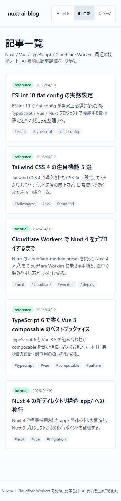
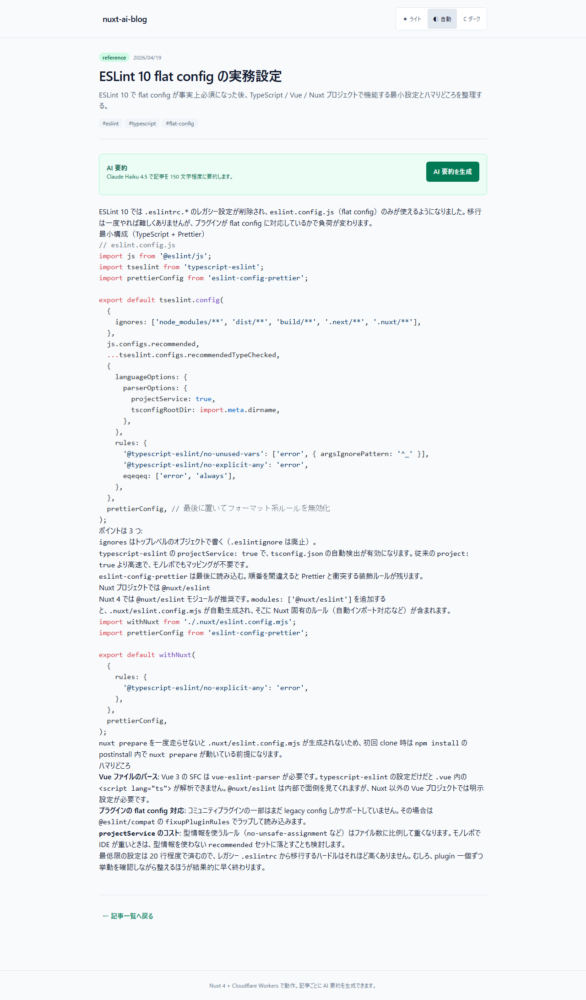
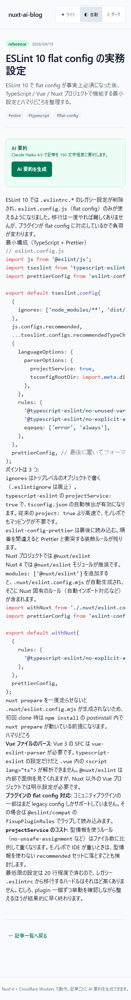
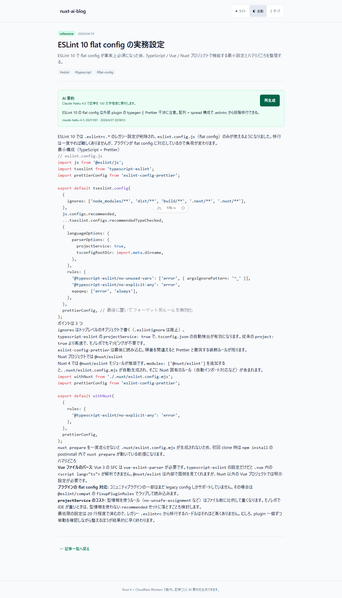
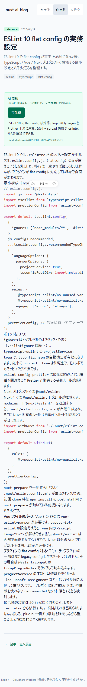
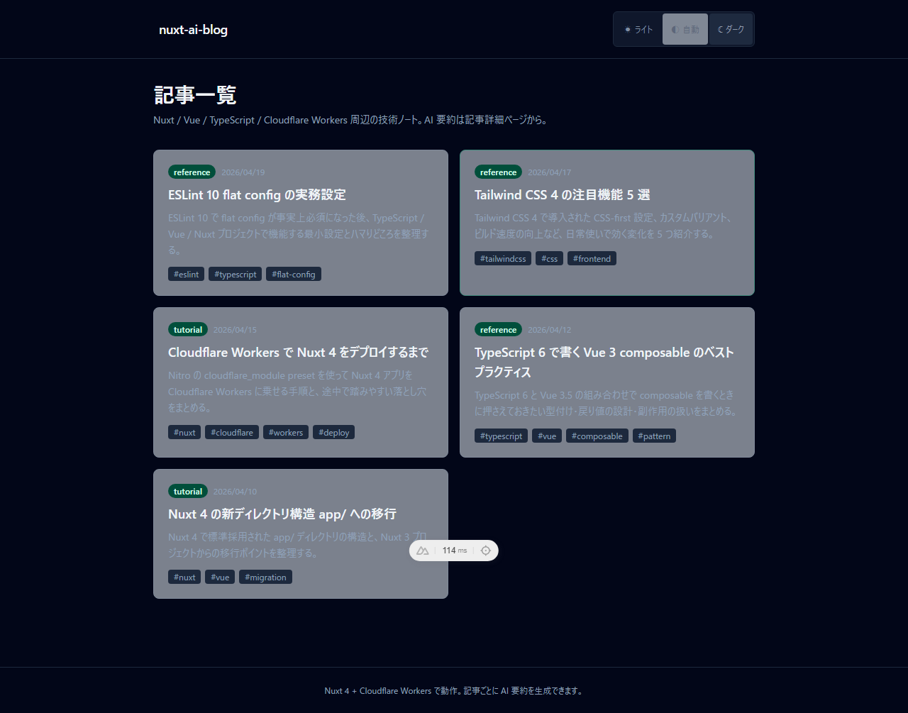
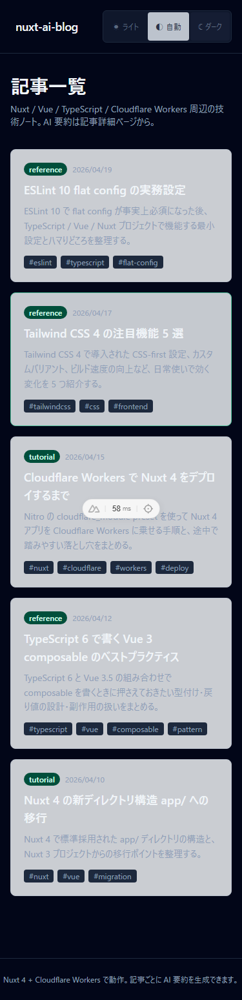

# nuxt-ai-blog

[](https://github.com/proto-atlas/nuxt-ai-blog/actions/workflows/ci.yml)

> Nuxt Contentベースの技術ブログ。記事検索とタグ絞り込み、記事ごとのAnthropic Claude AI要約を備えたデモです。

Markdownで書いた記事をNuxt Content 3 が読み取り、一覧ページと詳細ページに表示します。記事一覧では検索とタグ絞り込みができ、記事詳細ページでアクセスキーを入力するとClaude Haiku 4.5 が記事内容を 150 字以内に要約します。AI要約はアクセスキー、IP単位の短期制限、Durable Objectsの要約キャッシュと日次上限で呼び出し回数を抑えています。

## デモ

- **公開URL**: https://nuxt-ai-blog.atlas-lab.workers.dev
- **GitHub**: https://github.com/proto-atlas/nuxt-ai-blog

## 確認の流れ

- **30 秒で見る**: 公開URLで記事一覧、検索、タグ絞り込み、記事詳細をアクセスキーなしで確認できます。
- **5 分で見る**: [docs/verification.md](./docs/verification.md) に、公開URLで確認できる範囲、キー保護範囲、主な証跡への導線をまとめています。
- **検証記録**: [docs/evidence/INDEX.md](./docs/evidence/INDEX.md) に、README上の主張と証跡ファイルの対応をまとめています。
- **実API**: 課金・乱用防止のためアクセスキーで保護しています。

### なぜAI要約はアクセスキー制か

Anthropic APIは従量課金のため、無認証で公開するとAIコストを意図せず消費する可能性があります。AI要約のアクセスキーはユーザー認証ではなく、公開URLの実API要約の利用量を抑えるためのものです。実API機能は、アクセスキー、IP単位の短期制限、固定名 `GlobalSummaryQuotaDO` の日次上限、`SummaryCacheDO`、Anthropic Spend Limitを併用しています。ユーザー登録を含む運用にする場合は、相手別キー、期限付きキー、利用量の相手別追跡を追加する想定です。

## 品質確認 (2026-04-29 確認)

| 検査 | コマンド | 結果 |
|---|---|---|
| typecheck | `npm run typecheck` | exit 0 (Nuxt typecheck、`vue-tsc` 経由) |
| lint | `npm run lint` | exit 0 (warning 0、ESLint + Prettier) |
| Vitest unit | `npm run test:coverage -- --maxWorkers=1` | **126 件 通過 / 20 ファイル** |
| Vitest coverage | `npm run test:coverage -- --maxWorkers=1` | stmts 85.51 / branches 79.54 / funcs 90.74 / lines 87.10 (gate `lines>=60 / branches>=50 / funcs>=70 / statements>=60` 通過) |
| Nitro build | `npm run build` | 942 kB / 310 kB gzip (Cloudflare Workers Module preset) |
| Playwright E2E | `npm run e2e -- --project=chromium` | **11 / 11 通過** (ai-summary 3 + blog 5 + a11y target-size 3、1 worker固定) |
| 品質確認 | `npm run verify:quality` | 上記の主要検査を順に実行 |

`docs/evidence/` 配下に各検査の根拠を保存。`npm audit --audit-level=high` は 2026-04-29 時点で 0 vulnerabilities。

## 検証記録

| 検証記録 | 用途 |
|---|---|
| [`docs/evidence/a11y-target-size-2026-04-27.md`](docs/evidence/a11y-target-size-2026-04-27.md) | WCAG 2.2 Target Size 44×44 の対象サイズ検査結果 |
| [`docs/evidence/production-check-2026-04-28.md`](docs/evidence/production-check-2026-04-28.md) | 公開URLの基本導線と `/api/summary` invalid payloadの疎通確認結果 |
| [`docs/evidence/dependency-audit-2026-04-28.md`](docs/evidence/dependency-audit-2026-04-28.md) | `npm audit --audit-level=high --json` の結果 (0 vulnerabilities) |
| [`docs/evidence/lighthouse-2026-04-28.md`](docs/evidence/lighthouse-2026-04-28.md) | 公開URLのLighthouse 13.0.1 計測結果 |
| [`docs/evidence/release-baseline-2026-04-29.md`](docs/evidence/release-baseline-2026-04-29.md) | リリース時検証の特定時点記録 |
| [`docs/evidence/summary-abuse-protection-2026-04-29.md`](docs/evidence/summary-abuse-protection-2026-04-29.md) | `/api/summary` の濫用対策確認 |
| [`docs/evidence/summary-durable-objects-2026-04-29.md`](docs/evidence/summary-durable-objects-2026-04-29.md) | Durable Objects summary cache / global daily quotaの実装確認 |
| [`docs/evidence/production-check-2026-04-29.md`](docs/evidence/production-check-2026-04-29.md) | deploy後の公開URL、未認証拒否、本番実API要約疎通確認結果 |
| [`docs/evidence/INDEX.md`](docs/evidence/INDEX.md) | 検証記録の対応表 |
| [`docs/evidence/README.md`](docs/evidence/README.md) | 検証記録ディレクトリ全体の目次 |

## 画面

PC (1280×800) とSP (375×812 / iPhone 15 相当) で記事一覧、記事詳細、AI要約結果、ダークモードの 4 シーンを撮影。AI要約はPlaywright `page.route` で `/api/summary` を 200 応答に置き換え、実Anthropicへの課金を発生させていません (`scripts/capture-screenshots.mjs`)。

| シーン | PC (1280×800) | SP (375×812) |
|---|---|---|
| 記事一覧 |  |  |
| 記事詳細 |  |  |
| AI要約結果 |  |  |
| ダークモード |  |  |

撮影手順: 別ターミナルで `npm run dev` を起動 → `npm run capture:screenshots` で 8 枚生成 (`docs/screenshots/*.png`)。

## 主な機能

- **AI要約**: 記事ごとにClaude Haiku 4.5 で 150 字以内の日本語要約を生成（Cloudflare Workers Edge実行）。要約源はtitle + description + 本文MDC ASTから抽出したtextを 4000 文字で切り詰め
- **記事検索 / タグ絞り込み**: 記事一覧でtitle / description / category / tagsをクライアント側で即時フィルタ
- **キャッシュ**: 同slug、article hash、modelの連続呼び出しは `SummaryCacheDO` (TTL 1h) でコストを抑え、`cached: true` バッジで可視化。開発時とテスト時だけメモリ上の代替処理に切り替え
- **多層コスト保護**: AI生成はサーバー側secret `NUXT_SUMMARY_ACCESS_KEY` によるアクセスキー必須。さらにIP単位のsliding window 10 req/60s（CF-Connecting-IPベース）、固定名 `GlobalSummaryQuotaDO` の日次生成上限 200 req/UTC日（環境変数NUXT_DAILY_LIMITで上書き可）、Anthropic Spend Limit ($5〜$10/月) を併用。429 時は `Retry-After` ヘッダで再試行目安を返す
- **エラー設計**: `SummaryErrorCode` union (access_required / rate_limit / invalid_input / article_not_found / upstream_unavailable / server_misconfigured / unknown) に統一、UIには日本語ラベルのみ表示。SDK例外の生message / 環境変数名 / Zod詳細はconsole.errorでサーバー側にのみ残す
- **ダークモード 3 択**: ライト / 自動 / ダーク、`@nuxtjs/color-mode` + Tailwind v4 `@custom-variant` 連動、`localStorage` 永続化
- **セキュリティヘッダ 6 件**: nosniff / X-Frame-Options DENY / Referrer-Policy / Permissions-Policy / HSTS / Content-Security-PolicyをNitro `routeRules` で全ルート一括付与
- **client disconnect時の課金保護**: `wrangler.jsonc` に `enable_request_signal` flagを設定、ページ離脱時にAnthropic SDKの リクエストがabortされる

## 使用技術

- Nuxt 4.4.2 + Vue 3.5 + TypeScript 6 (strict)
- @nuxt/content 3 (Markdown管理 + MDC AST走査で本文抽出)
- @nuxtjs/color-mode (class戦略ダークモード)
- @nuxtjs/sitemap (動的URL生成)
- Tailwind CSS 4 (Viteプラグイン経由)
- @anthropic-ai/sdk 0.90 (AI要約)
- ESLint 10 (flat config, @nuxt/eslint統合)
- Vitest 4 + @nuxt/test-utils + happy-dom (Unit 126 件、coverage stmts 85.51 / branches 79.54 / funcs 90.74 / lines 87.10)
- Playwright 1.59 (E2E Chromium 11 シナリオ: blog 5 + AI要約 3 page.route応答置き換え + a11y target-size 3)
- Cloudflare Workers (Nitro cloudflare_module preset) + Durable Objects (`GlobalSummaryQuotaDO`, `SummaryCacheDO`)

## Lighthouse (公開URL)

[公開URL](https://nuxt-ai-blog.atlas-lab.workers.dev/) を 2026-04-28 時点 (Lighthouse 13.0.1, Edge headless) で計測:

| Strategy | Performance | Accessibility | Best Practices | SEO |
|---|---:|---:|---:|---:|
| desktop | 99 | 100 | 100 | 100 |
| mobile | 93 | 100 | 100 | 100 |

Core Web Vitals: desktop FCP 0.6s / LCP 0.6s / TBT 0ms / CLS 0、mobile FCP 1.6s / LCP 1.6s / TBT 290ms / CLS 0。詳細は [`docs/evidence/lighthouse-2026-04-28.md`](docs/evidence/lighthouse-2026-04-28.md)。

## 必要環境

- Node.js 24.x LTS
- npm 11+

## 開発

```bash
npm install # nuxt prepareがpostinstallで走る
npm run dev # http://localhost:3000
```

## デプロイ

Cloudflare Workersへdeployする前に、AI要約用のsecretを登録します。

```bash
npx wrangler secret put NUXT_ANTHROPIC_API_KEY
npx wrangler secret put NUXT_SUMMARY_ACCESS_KEY
npm run deploy
```

`wrangler.jsonc` にはsummary cache / quota用のDurable Objects bindingとSQLite-backed migrationを含めています。`nuxt build` 後に `wrangler deploy --dry-run` で `SUMMARY_QUOTA` / `SUMMARY_CACHE` / `DB` / `ASSETS` bindingが認識されることを確認済みです。

## テスト

```bash
npm run check # typecheck + lint + Vitest
npm run test:coverage # coverage閾値
npx playwright test --project=chromium # E2E Chromium (11 シナリオ)
```

`/api/summary` は `page.route('**/api/summary')` でJSON応答に置き換え、実Anthropicへの課金を発生させません。AI要約E2Eではアクセスキー入力後の成功フロー、429 rate_limit、500 upstream_unavailableの 3 ケースを検証し、エラー時に内部詳細 (Anthropic / stack等) がUIに出ないことを確認しています。

## CI設定

`.github/workflows/ci.yml` の構成:

| ジョブ | 内容 |
|---|---|
| `quality-check` | typecheck → lint → `test:coverage` (閾値強制) → `npm audit --audit-level=high` → secret scan → build |
| `e2e` | Playwright Chromium 11 シナリオ。`quality-check` 通過後 |
| `deploy` | `main` へのpushのみ。`quality-check` + `e2e` 通過後、`CLOUDFLARE_API_TOKEN` + `CLOUDFLARE_ACCOUNT_ID` がrepo secretsに登録されている場合だけCloudflare Workersへ自動deploy。未設定の場合はskip |

## 依存関係と制約

### npm audit (moderate残)

`npm audit --audit-level=high` をCI quality-checkで実行しています。一方でmoderateレベルはNuxt 4、Nitro、`@nuxt/content`、`@anthropic-ai/sdk` のtransitive由来でアップストリーム修正待ちのため、意図的に許容しています。

### Cloudflare Workersのisolate分散とrate limit

`/api/summary` の要約キャッシュと日次上限はDurable Objectsに移行しています。日次上限の基準値は固定名 `GlobalSummaryQuotaDO` に置き、slug、IP、articleHash、cache keyごとには分散させません。要約キャッシュは `SummaryCacheDO` で `summary:v1:<model>:<slug>:<articleHash>` をkeyにし、記事更新やmodel変更時に古い要約を使わない設計です。IP単位のsliding windowは引き続きメモリ上の短期制限なので、ユーザー登録を含む運用にする場合はCloudflare Rate Limiting bindingやTurnstileとの併用を検討します。

### `@nuxt/content` のsqlite-wasm

dev / Node.js native sqliteで動かしており、Cloudflare Workers本番では `@nuxt/content` がD1 databaseに自動切替する旨の警告が出ます (`Deploying to Cloudflare requires using D1 database`)。SPA遷移時のNuxt Content client queryがsqlite-wasmを使うため、CSPは `unsafe-eval` を許可せずWebAssembly限定の `wasm-unsafe-eval` だけを `script-src` に追加しています。D1 bindingへの完全移行とclient bundleのsqlite-wasm削減は今後の運用課題です。

### AI要約アクセスキー

`/api/summary` はserver-only secret `NUXT_SUMMARY_ACCESS_KEY` とリクエストヘッダ `X-Summary-Access-Key` を照合します。公開ページは閲覧可能なまま、実API生成だけ利用条件を設けるための境界です。ユーザー別権限管理ではないため、ユーザー登録を含む運用にする場合はTurnstile、Cloudflare Access、Durable Objects、またはアカウント制の認証に置き換えてください。

## ライセンス

MIT
